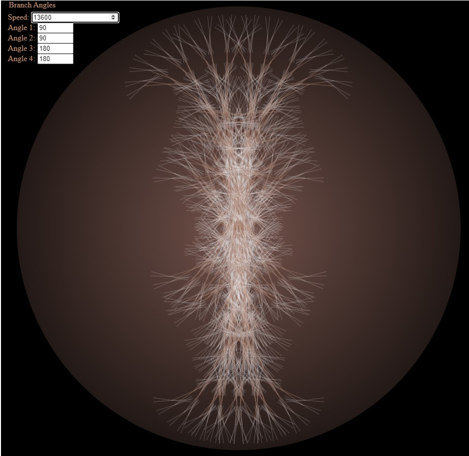

# Fractal_Dandelion
Fractal Dandelion is a harmonic visualizer based on a recursive fractal tree algorithm.

Speed: 
    100 - Very Fast
    1000 - Fast 
    4000 - Medium (default)
    10000 - Medium Slow
    100000 - Slow
    1000000+ - Very Slow

Angles:
    Try symmetric angles that are divisors of 360.
    1, 2, 3, 4, 5, 6, 8, 9, 10, 12, 15, 18, 20, 24, 30, 36, 40, 45, 60, 72, 90, 120, 180, 360.
    Or try other variables, there are a lot of different things to see.

